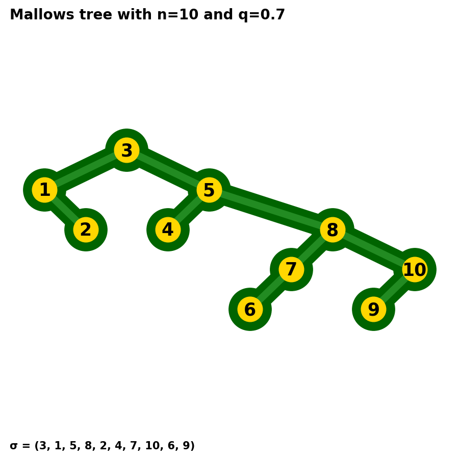

# Mallows trees

This project computes and represents Mallows trees.

It is meant to represent the work in [The height of Mallows trees](https://arxiv.org/abs/2007.13728).

## Getting started

### Running the code

The library requirements for this code can be found in `requirements.txt`. To install them, run the following command line in the terminal:
```sh
pip install -r requirements.txt
```
Once this is done or if the required libraries are already installed, run the following:
```sh
python main.py
```

### Organization of the code

`model.py` contains the two classes `MallowsPermutation` and `MallowsTree`. The class `MallowsTree` builds a binary search tree from an instance of the `MallowsPermutation` class.

`plots.py` contains the class `TreePlots` which is used to represent instances of the `MallowsTree` class. It has three main functions:
* `tree` which creates an image representing the tree.
* `construction` which creates a gif representing the construction of the Mallows tree from its permutation.
* `evolution` which creates a gif representing the evolution of a Mallows tree according to its parameter q.

`main.py` is used to run the algorithms.

## Results

This code produces three types of results, all implemented in `plots.py`.

### Tree representation

The first result, obtained when running the function `tree`, is a representation of the corresponding Mallows tree. The position of a node corresponds to its value and depth. Typical figures look like the following.

<p align="center"></p>

### Tree construction

The second result, obtained when running the function `construction`, is a representation of the recursive construction of a Mallows tree. It corresponds to the typical construction of binary search trees from a permutation, where entries of the permutation are added one after the other in the tree, and such that the label on each node is larger than the labels of its left subtree and larger than the labels of its right subtree. Typical figures look like the following.

<p align="center"></p>

### Tree evolution

The third and last result, obtained when running the function `evolution`, is a representation of the changing behaviour of a Mallows tree with its parameter q. A specific coupling is used here to obtain correlated trees (see the definition of `MallowsPermutation` in `model.py`). Typical figures look like the following.

<p align="center"></p>

## Contact and information

If you have any questions regarding the code, feel free to contact me at <benoitcorsini@gmail.com>.

More figures can be found [here](https://www.math.mcgill.ca/bcorsini/cv/math.html).